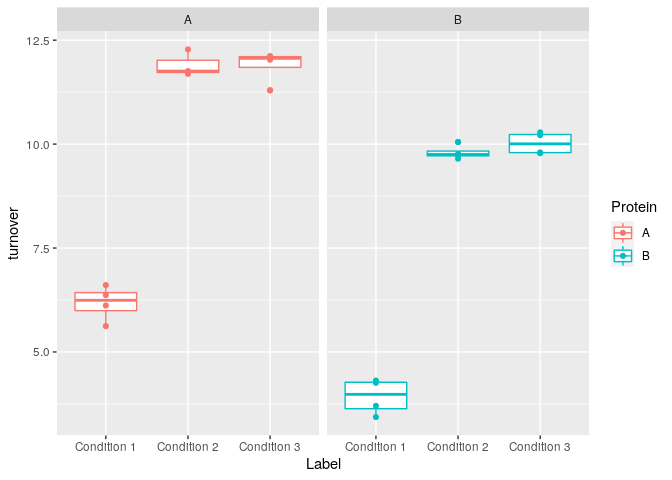

<!-- README.md is generated from README.Rmd. Please edit that file -->

# jasco2

**Warning: This package is still under development \!**

A package for easy Spectrophotometer data handling.

## Installation

You can install the released version of jasco2 from GitHub.

``` r
# should not work, since the repo is private
devtools::install_github("mirkko-hub/jasco2")
```

## Example

Easy data handling of Jasco spectrophotometer (JASCO Corp., V-560,
Rev. 1.00) files - you only need three things:

  - **data** *(.txt output from spectrophotometer)*
  - **design** *(record of individual files and grouping information +
    optional flagging for removal, notes)*
  - **treatmemt** *(additional information specifying the different
    groups)*

##### Import files

``` r
library(tidyverse, warn.conflicts = FALSE)
#> ── Attaching packages ────────────────────────────────────────────────────────────────────────────────────────────────────────────────────── tidyverse 1.3.0 ──
#> ✓ ggplot2 3.3.2     ✓ purrr   0.3.4
#> ✓ tibble  3.0.3     ✓ dplyr   1.0.2
#> ✓ tidyr   1.1.2     ✓ stringr 1.4.0
#> ✓ readr   1.4.0     ✓ forcats 0.5.0
#> ── Conflicts ───────────────────────────────────────────────────────────────────────────────────────────────────────────────────────── tidyverse_conflicts() ──
#> x dplyr::filter() masks stats::filter()
#> x dplyr::lag()    masks stats::lag()
library(magrittr, warn.conflicts = FALSE)
library(jasco2)
```

*Given a bunch of .txt files from Jasco Spec,*

``` r
files <- system.file("extdata", paste0(1:28, ".txt") , package = "jasco2", mustWork = TRUE)
head(files)
#> [1] "/home/mirkko/R/x86_64-pc-linux-gnu-library/4.0/jasco2/extdata/1.txt"
#> [2] "/home/mirkko/R/x86_64-pc-linux-gnu-library/4.0/jasco2/extdata/2.txt"
#> [3] "/home/mirkko/R/x86_64-pc-linux-gnu-library/4.0/jasco2/extdata/3.txt"
#> [4] "/home/mirkko/R/x86_64-pc-linux-gnu-library/4.0/jasco2/extdata/4.txt"
#> [5] "/home/mirkko/R/x86_64-pc-linux-gnu-library/4.0/jasco2/extdata/5.txt"
#> [6] "/home/mirkko/R/x86_64-pc-linux-gnu-library/4.0/jasco2/extdata/6.txt"
```

*… some design tibble,*

``` r
design <- readr::read_csv(system.file("extdata", "design.csv", package = "jasco2", mustWork = TRUE))
#> 
#> ── Column specification ───────────────────────────────────────────────────────────────────────────────────────────────────────────────────────────────────────
#> cols(
#>   Exp_ID = col_double(),
#>   Group = col_character(),
#>   FLAG = col_double(),
#>   Note = col_character()
#> )
head(design)
#> # A tibble: 6 x 4
#>   Exp_ID Group  FLAG Note      
#>    <dbl> <chr> <dbl> <chr>     
#> 1      1 blank    NA <NA>      
#> 2      2 A         1 wrong tube
#> 3      3 A        NA <NA>      
#> 4      4 A        NA <NA>      
#> 5      5 A        NA <NA>      
#> 6      6 B        NA <NA>
```

*… and and a treatment tibble,*

``` r
treatment <- readr::read_csv(system.file("extdata", "treatment.csv", package = "jasco2", mustWork = TRUE))
#> 
#> ── Column specification ───────────────────────────────────────────────────────────────────────────────────────────────────────────────────────────────────────
#> cols(
#>   Group = col_character(),
#>   Label = col_character(),
#>   Protein = col_character()
#> )
head(treatment)
#> # A tibble: 6 x 3
#>   Group Label       Protein
#>   <chr> <chr>       <chr>  
#> 1 A     Control     <NA>   
#> 2 B     Condition 1 A      
#> 3 C     Condition 2 A      
#> 4 D     Condition 3 A      
#> 5 E     Condition 1 B      
#> 6 F     Condition 2 B
```

*we can easily combine all information in a tidy tibble, that
facilitates further analysis\!*

``` r
df <- jasco_tibble(filenames = files, design, treatment, rmflag = FALSE, rmblank = TRUE)
head(df)
#> # A tibble: 6 x 10
#>   Set_ID              Instrument Exp_ID Time_s Absorbance Group  FLAG Note 
#>   <dttm>              <chr>       <dbl>  <dbl>      <dbl> <chr> <dbl> <chr>
#> 1 2018-01-18 19:54:37 JASCO Cor…      2      0       1.81 A         1 wron…
#> 2 2018-01-18 19:54:37 JASCO Cor…      2      1       1.82 A         1 wron…
#> 3 2018-01-18 19:54:37 JASCO Cor…      2      2       1.81 A         1 wron…
#> 4 2018-01-18 19:54:37 JASCO Cor…      2      3       1.81 A         1 wron…
#> 5 2018-01-18 19:54:37 JASCO Cor…      2      4       1.81 A         1 wron…
#> 6 2018-01-18 19:54:37 JASCO Cor…      2      5       1.81 A         1 wron…
#> # … with 2 more variables: Label <chr>, Protein <chr>
```

##### Process data

In the given example, we performed an enzyme coupled ATP hydrolysis
assay. So we measured NADH oxidation (the consumption of NADH is
recorded at 340 nm) as a response to ATP hydrolysis via the depicted
reaction - each oxidized NADH molecule reports the hydrolysis of one
molecule of ATP.

Let’s say we want to calculate turnover rates of the ATPase of interest.
All we need to do is:

  - convert absorbance units into concentration
  - apply a linear model (with customized interval, response and
    predictor variables)
  - extract the slopes (estimates) for all reaction
  - and convert these into turnover rates

*(with optional summary by specified groups)*

**like so:**

``` r
data <- df %>%
  convert_absorbance(., "NADH") %>%
  jasco_extract_lm(., response = NADH, predictor = Time_s, min = 75, max = 175)
#> Warning: All elements of `...` must be named.
#> Did you want `data = c(Time_s, NADH, Absorbance)`?
head(data)
#> # A tibble: 6 x 14
#>   Set_ID              Instrument Exp_ID Group  FLAG Note  Label Protein data 
#>   <dttm>              <chr>       <dbl> <chr> <dbl> <chr> <chr> <chr>   <lis>
#> 1 2018-01-18 19:54:37 JASCO Cor…      2 A         1 wron… Cont… <NA>    <tib…
#> 2 2018-01-18 20:02:06 JASCO Cor…      3 A        NA <NA>  Cont… <NA>    <tib…
#> 3 2018-01-18 20:09:48 JASCO Cor…      4 A        NA <NA>  Cont… <NA>    <tib…
#> 4 2018-01-18 20:17:15 JASCO Cor…      5 A        NA <NA>  Cont… <NA>    <tib…
#> 5 2018-01-18 16:00:27 JASCO Cor…      6 B        NA <NA>  Cond… A       <tib…
#> 6 2018-01-18 16:09:14 JASCO Cor…      7 B        NA <NA>  Cond… A       <tib…
#> # … with 5 more variables: mod <list>, glance <list>, tidy <list>,
#> #   augment <list>, rsq <dbl>
  
params <- data %>%
  jasco_extract_params(., .bgcorr = FALSE, .protein_uM = 6, .unit = "sec", .factor = -1, Group)
head(params$data)
#> # A tibble: 6 x 20
#>   Set_ID              Instrument Exp_ID Group  FLAG Note  Label Protein data 
#>   <dttm>              <chr>       <dbl> <chr> <dbl> <chr> <chr> <chr>   <lis>
#> 1 2018-01-18 19:54:37 JASCO Cor…      2 A         1 wron… Cont… <NA>    <tib…
#> 2 2018-01-18 20:02:06 JASCO Cor…      3 A        NA <NA>  Cont… <NA>    <tib…
#> 3 2018-01-18 20:09:48 JASCO Cor…      4 A        NA <NA>  Cont… <NA>    <tib…
#> 4 2018-01-18 20:17:15 JASCO Cor…      5 A        NA <NA>  Cont… <NA>    <tib…
#> 5 2018-01-18 16:00:27 JASCO Cor…      6 B        NA <NA>  Cond… A       <tib…
#> 6 2018-01-18 16:09:14 JASCO Cor…      7 B        NA <NA>  Cond… A       <tib…
#> # … with 11 more variables: mod <list>, glance <list>, term <chr>,
#> #   estimate <dbl>, std.error <dbl>, statistic <dbl>, p.value <dbl>,
#> #   augment <list>, rsq <dbl>, rate <dbl>, turnover <dbl>
head(params$summary)
#> # A tibble: 6 x 5
#>   groups_Group     rate_avg       rate_sd turnover_avg turnover_sd
#>   <chr>               <dbl>         <dbl>        <dbl>       <dbl>
#> 1 A            -0.000000526 0.00000000909         5.26      0.0909
#> 2 B            -0.000000618 0.0000000423          6.18      0.423 
#> 3 C            -0.00000119  0.0000000322         11.9       0.322 
#> 4 D            -0.00000119  0.0000000396         11.9       0.396 
#> 5 E            -0.000000393 0.0000000428          3.93      0.428 
#> 6 F            -0.000000980 0.0000000174          9.80      0.174
```

##### Plot data

``` r
ggplot() +
  geom_point(data = data %>% unnest(data) %>% filter(., Label != "Control"),
             mapping = aes(x = Time_s, y = NADH), size = 0.1) +
  geom_path(data = data %>% unnest(augment) %>% filter(., Label != "Control"),
            mapping = aes(x = Time_s, y = .fitted, group = Exp_ID), colour = "blue") +
  facet_grid(Label ~ Protein)
```


``` r
ggplot() +
  geom_boxplot(data = params$data %>% filter(Label != "Control"), aes(x = Label, y = turnover, colour = Protein)) +
  geom_point(data = params$data %>% filter(Label != "Control"), aes(x = Label, y = turnover, colour = Protein)) +
  facet_grid(. ~ Protein)
```


